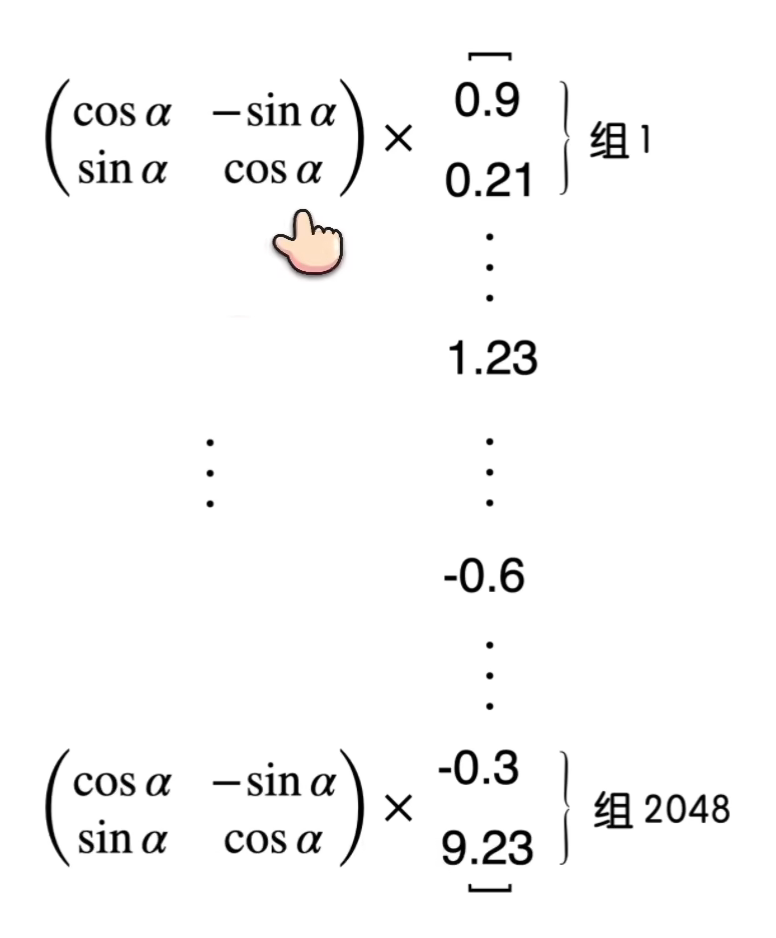
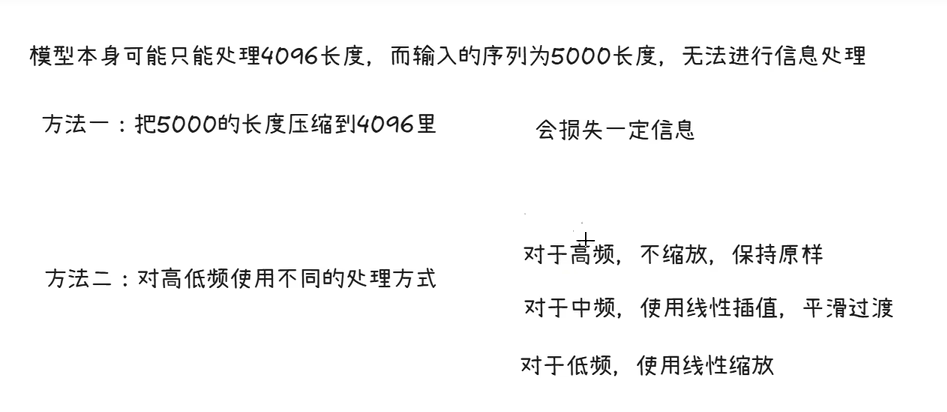

# TinyMind 公式推导详解

本文档记录 TinyMind 项目中各核心模块的数学推导过程，作为 README 的补充材料。

---

## 1. RMSNorm

假设输入向量为 $x=(x_1,x_2,...,x_n)$，RMSNorm 的计算分为两步：

1. 计算 $x_i^2$ 的平方和 $S_i=\sum_{j=1}^n x_j^2$
2. 计算 $x_i$ 的归一化值：

$$
x_i'=\frac{x_i}{\sqrt{\frac{S_i}{n}}+\epsilon}\gamma
$$

其中 $\epsilon$ 是一个小的常量，用于避免除零错误，$\gamma$ 是缩放因子，是一个可训练的参数，默认值为 $1.0$。

### 与 LayerNorm 的区别

LayerNorm 的计算为：

$$
\text{LayerNorm}(x) = \frac{x - \mu}{\sigma} \cdot \gamma + \beta
$$

其中 $\mu$ 为均值，$\sigma$ 为标准差。RMSNorm 去除了均值中心化步骤（即没有 $-\mu$ 和 $+\beta$），只保留缩放操作，因此计算更高效。

---

## 2. RoPE 旋转位置编码

### 2.1 旋转矩阵

首先了解在不改变模长的情况下向量如何进行旋转。我们可以使用旋转矩阵：

$$
R(\theta)=\begin{pmatrix}
\cos \theta & -\sin \theta \\
\sin \theta & \cos \theta
\end{pmatrix}
$$

### 2.2 位置编码思想

如果当前词为第 $m$ 个词，那就将它旋转 $m\theta$ 度；如果为第 $n$ 个词，则将它旋转 $n\theta$ 度。这里的 $\theta$ 是一个角度的基本单位，是一个常量。

令旋转后的 $q$ 和 $k$ 为 $q'$ 和 $k'$，其中：

$$
q'=R(m\theta) \cdot q, \quad k'=R(n\theta) \cdot k
$$

### 2.3 注意力分数推导

我们知道 $(AB)^T=B^TA^T$，那么新的注意力分数为：

$$
\text{Score} = (q')^T \cdot k' 
= q^T \cdot R(m\theta)^T \cdot R(n\theta) \cdot k
$$

### 2.4 旋转矩阵乘积

将 $R(m\theta)^T \cdot R(n\theta)$ 展开：

$$
R(m\theta)^\mathrm{T}
=
\begin{pmatrix}
\cos m\theta & \sin m\theta \\
-\sin m\theta & \cos m\theta
\end{pmatrix}
$$

$$
R(n\theta)
=
\begin{pmatrix}
\cos n\theta & -\sin n\theta \\
\sin n\theta & \cos n\theta
\end{pmatrix}
$$

逐元素计算，结合积化和差公式：

$$
\begin{aligned}
C_{11}
&= a_{11}b_{11} + a_{12}b_{21} \\
&= \cos m\theta \cdot \cos n\theta + \sin m\theta \cdot \sin n\theta \\
&= \cos\left(n\theta - m\theta\right) \\
&= \cos\big((n-m)\theta\big)
\end{aligned}
$$

$$
\begin{aligned}
C_{12}
&= a_{11}b_{12} + a_{12}b_{22} \\
&= \cos m\theta \cdot (-\sin n\theta) + \sin m\theta \cdot \cos n\theta \\
&= -\left(\cos m\theta \sin n\theta - \sin m\theta \cos n\theta\right) \\
&= -\sin\left(n\theta - m\theta\right) \\
&= -\sin\big((n-m)\theta\big)
\end{aligned}
$$

$$
\begin{aligned}
C_{21}
&= a_{21}b_{11} + a_{22}b_{21} \\
&= -\sin m\theta \cdot \cos n\theta + \cos m\theta \cdot \sin n\theta \\
&= \sin\left(n\theta - m\theta\right) \\
&= \sin\big((n-m)\theta\big)
\end{aligned}
$$

$$
\begin{aligned}
C_{22}
&= a_{21}b_{12} + a_{22}b_{22} \\
&= -\sin m\theta \cdot (-\sin n\theta) + \cos m\theta \cdot \cos n\theta \\
&= \cos m\theta \cos n\theta + \sin m\theta \sin n\theta \\
&= \cos\left(n\theta - m\theta\right) \\
&= \cos\big((n-m)\theta\big)
\end{aligned}
$$

### 2.5 最终结果

$$
R(m\theta)^\mathrm{T} R(n\theta)
=
\begin{pmatrix}
\cos\left((n-m)\theta\right) & -\sin\left((n-m)\theta\right) \\
\sin\left((n-m)\theta\right) & \cos\left((n-m)\theta\right)
\end{pmatrix}
= R\big((n-m)\theta\big)
$$

我们发现它等于 $R((n-m)\theta)$，这样我们就得到了关于相对位置的信息，最终注意力分数可以化简为：

$$
\text{Score} = q^T \cdot R(m\theta)^T \cdot R(n\theta) \cdot k = q^T \cdot R((n-m)\theta) \cdot k
$$

### 2.6 高维分组策略

上面的例子中 $q$ 和 $k$ 都是二维的，但在实际中词向量的维度往往很大，所以 RoPE 采用了分治法的思想，两两位一组，每组各转各的：



### 2.7 多频率设计

当我们逆时针旋转 $10$ 度和逆时针旋转 $370$ 度其实没有本质区别。为了区分，RoPE 为每一组设计了不同的 $\theta$，让每一组的转速都不同：

- 组的维数越低，频率越快
- 组的维数越高，频率越慢

$$
\theta_i = 10000^{-\frac{2(i-1)}{d_{\mathrm{model}}}}, \quad i \in \left[1,2,\dots,\frac{d}{2}\right]
$$

这部分借鉴了《Attention is All you Need》中正余弦位置编码。

引入不同频率之后，位置信息就由这 $n$ 组不同的旋转向量共同表示了，即使前面的部分有重叠，但是仍然可以靠后面的向量区分出来。

---

## 3. YARN 位置编码缩放



### 3.1 波长定义

在原始 RoPE 中，位置 $m$ 对应的旋转角度为 $m \cdot \theta_i$。其**波长（Wavelength）** $\lambda_i$ 定义为该维度完成一次完整旋转（$2\pi$）所需的 token 距离：

$$
\lambda_i = \frac{2\pi}{\theta_i}=2\pi \cdot 10000^{\frac{2(i-1)}{d_{\mathrm{model}}}}
$$

### 3.2 波长比率

定义比率 $r_i$ 来衡量波长相对于训练长度的倍数：

$$
r_i=\frac{L}{\lambda_i}
$$

- 当 $r_i \ll 1$（即 $\lambda_i \gg L$）时，属于**低频维度**（波长极长），负责全局绝对位置。
- 当 $r_i \gg 1$（即 $\lambda_i \ll L$）时，属于**高频维度**（波长极短），负责局部相对位置。

### 3.3 维度索引映射

求出 $i'$，令 $i'=i-1$：

$$
r_i = \frac{L}{2\pi \cdot 10000^{\frac{2(i-1)}{d_{\mathrm{model}}}}}
$$

$$
{10000^{\frac{2(i-1)}{d_{\mathrm{model}}}}}=\frac{L}{2\pi \cdot r_i}
$$

$$
e^{\frac{2(i-1)}{d_{model}} \cdot \ln 10000}=\frac{L}{2\pi \cdot r_i}
$$

$$
\frac{2(i-1)}{d_{model}}=\frac{\ln(\frac{L}{2\pi \cdot r_i})}{\ln 10000}
$$

$$
i'=\frac{d_{model} \cdot \ln(\frac{L}{2\pi \cdot r_i})}{2 \cdot \ln 10000}
$$

### 3.4 缩放因子

计算缩放因子 $\gamma_i$，用于控制每个维度的缩放程度：

$$
\gamma_i=
\begin{cases}
0, & i \le \mathrm{low} \\
\dfrac{i-\mathrm{low}}{\mathrm{high}-\mathrm{low}}, & \mathrm{low} < i < \mathrm{high} \\
1, & i \ge \mathrm{high}
\end{cases}
$$

其中：
- `low` 对应高频边界（波长比例 $\beta_{fast}$）
- `high` 对应低频边界（波长比例 $\beta_{slow}$）
- 在 `low` 之前不缩放，在 `high` 之后全量缩放，中间线性过渡

### 3.5 频率缩放

最终频率的缩放公式为：

$$
\theta'_i = \theta_i \cdot (1 - \gamma_i + \frac{\gamma_i}{s})
$$

其中 $s$ 为扩展倍数（`factor`）。

---

## 4. GQA（分组查询注意力）

### 4.1 基本概念

GQA 将注意力头分为若干组，每组共享一对 KV head：

- **MHA（Multi-Head Attention）**：每个 Q head 有独立的 KV head，即 `num_key_value_heads = num_attention_heads`
- **MQA（Multi-Query Attention）**：所有 Q head 共享一对 KV head，即 `num_key_value_heads = 1`
- **GQA（Grouped-Query Attention）**：介于两者之间，`1 < num_key_value_heads < num_attention_heads`

### 4.2 KV 重复

由于 KV head 数量少于 Q head 数量，在计算注意力前需要将 KV head 重复扩展：

$$
\text{rep\_n} = \frac{\text{num\_attention\_heads}}{\text{num\_key\_value\_heads}}
$$

例如默认配置中：$\text{rep\_n} = \frac{8}{2} = 4$，即每个 KV head 重复 4 次以匹配 Q head 数量。

### 4.3 显存优化

GQA 的核心优势在于 KV Cache 的显存占用：

| 注意力类型 | KV Cache 大小 | 相对比例 |
|-----------|--------------|---------|
| MHA | $2 \times n_{heads} \times d_{head} \times L$ | 100% |
| GQA | $2 \times n_{kv\_heads} \times d_{head} \times L$ | $\frac{n_{kv\_heads}}{n_{heads}}$ |
| MQA | $2 \times 1 \times d_{head} \times L$ | $\frac{1}{n_{heads}}$ |

默认配置下 GQA 的 KV Cache 仅为 MHA 的 $\frac{2}{8} = 25\%$。

---

## 5. Flash Attention

### 5.1 标准注意力

标准注意力的计算为：

$$
\text{Attention}(Q, K, V) = \text{softmax}\left(\frac{QK^T}{\sqrt{d_k}}\right) V
$$

其时间和空间复杂度均为 $O(n^2)$，其中 $n$ 为序列长度。

### 5.2 Flash Attention 原理

Flash Attention 通过分块（tiling）技术避免显式存储完整的 $n \times n$ 注意力矩阵：

1. 将 Q、K、V 分成小块（block）
2. 在 SRAM 中逐块计算注意力
3. 使用在线 softmax 算法累积结果
4. 避免将完整的注意力矩阵写入 HBM

### 5.3 PyTorch 实现

PyTorch 2.0+ 提供了原生的 Flash Attention 实现：

```python
F.scaled_dot_product_attention(q, k, v, is_causal=True)
```

在 TinyMind 中，当满足以下条件时自动启用 Flash Attention：
- PyTorch 版本支持 `scaled_dot_product_attention`
- 配置中 `flash_attention=True`
- 序列长度 > 1（非单 token 推理）
- 无 KV Cache（预填充阶段）
- 无自定义注意力掩码

---

## 参考文献

- [Attention Is All You Need](https://arxiv.org/abs/1706.03762) — Transformer 架构
- [RoFormer: Enhanced Transformer with Rotary Position Embedding](https://arxiv.org/abs/2104.09864) — 旋转位置编码
- [YaRN: Efficient Context Window Extension of Large Language Models](https://arxiv.org/abs/2309.00071) — 上下文长度扩展
- [GQA: Training Generalized Multi-Query Transformer Models from Multi-Head Checkpoints](https://arxiv.org/abs/2305.13245) — 分组查询注意力
- [FlashAttention: Fast and Memory-Efficient Exact Attention with IO-Awareness](https://arxiv.org/abs/2205.14135) — 高效注意力实现
- [Mixtral of Experts](https://arxiv.org/abs/2401.04088) — 混合专家架构
